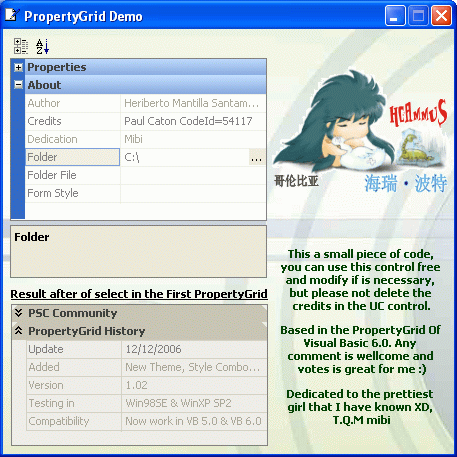



## PropertyGrid 1\.3 \(Update 05 Jan 2011\)

### Description

Addition 2 new themes, check out the screenshot, and more functions.

New functions for the color manipulation.

I think this the first control how this in PSC, this's a PropertyGrid based in the VB 6.0 PropertyGrid control (the screenshot tell all).

The credits are in the UC, I used some UC of PSC contributor.

Any comment are wellcome, ideas are good, vote is perfect for me but not are necessary :)

NOTE: I tested in WinXP only but in various PC's.

Thanks TerriTop
 
### More Info
 

             |
---                |---
**Submitted On**   |2011-01-03 14:05:18
**By**             |[Heriberto Mantilla Santamaria](https://github.com/Planet-Source-Code/PSCIndex/blob/master/ByAuthor/heriberto-mantilla-santamaria.md)
**Level**          |Intermediate
**User Rating**    |4.9 (193 globes from 39 users)
**Compatibility**  |VB 6\.0
**Category**       |[Custom Controls/ Forms/  Menus](https://github.com/Planet-Source-Code/PSCIndex/blob/master/ByCategory/custom-controls-forms-menus__1-4.md)
**World**          |[Visual Basic](https://github.com/Planet-Source-Code/PSCIndex/blob/master/ByWorld/visual-basic.md)
**Archive File**   |[PropertyGr219556152011\.zip](https://github.com/Planet-Source-Code/heriberto-mantilla-santamaria-propertygrid-1-3-update-05-jan-2011__1-67243/archive/master.zip)

